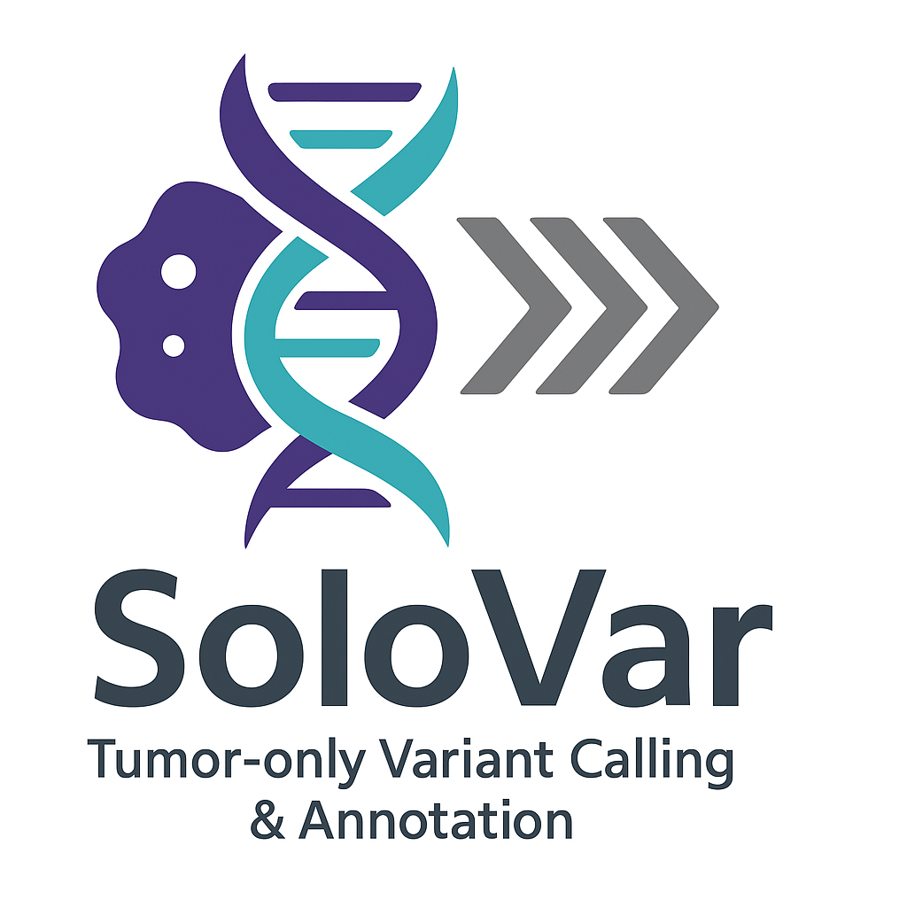
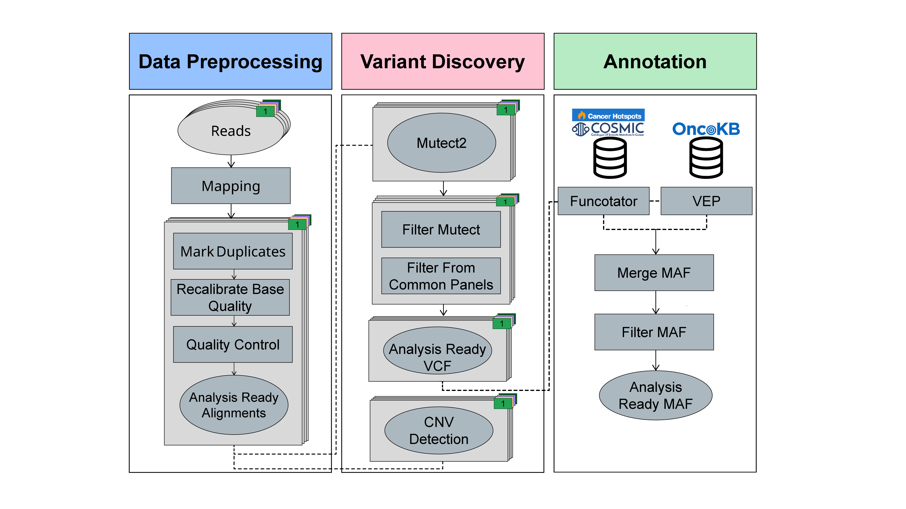
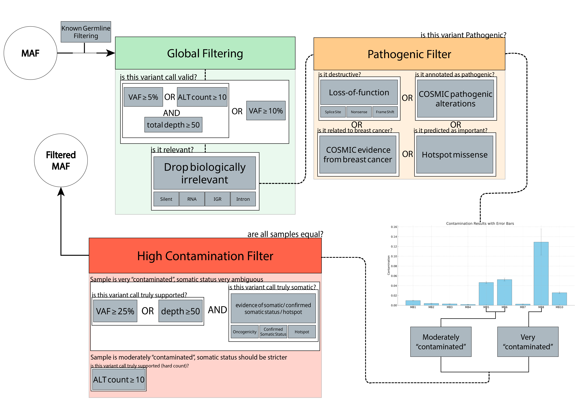
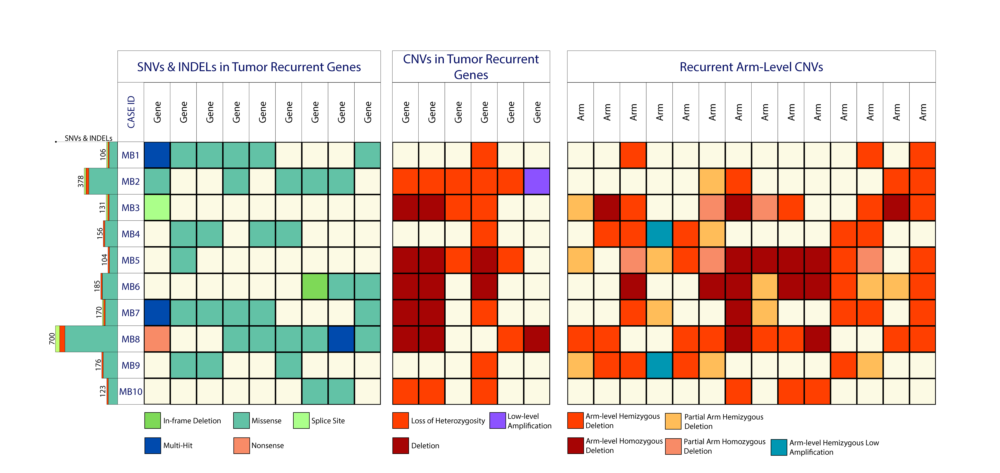
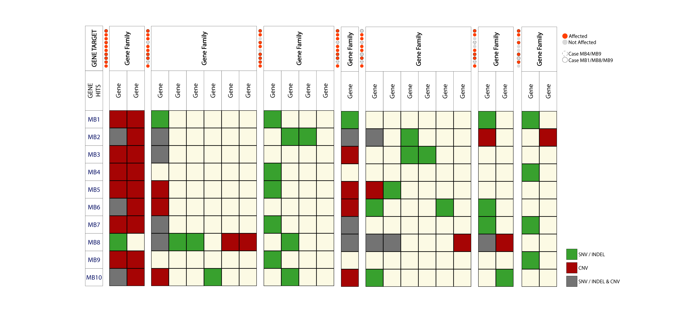

# SoloVar: Somatic Variant Analysis Pipelines
<p align="center">
  
</p>

**SoloVar** is a modular toolkit for somatic variant analysis (SNV & CNV) in tumor samples without a matching normal. It provides end-to-end pipelines for trimming, mapping, variant calling, and annotation, all driven by simple YAML configuration files.

<p align="center">
  
</p>


---


## 📦 Pipeline Overview

| Script                          | Purpose                                      |
|----------------------------------|----------------------------------------------|
| `trimming_pipeline.sh`           | QC and trim raw FASTQ files                  |
| `mapping_pipeline.sh`            | Map reads, mark duplicates, BQSR, QC         |
| `qc_pipeline.py`                 | Generate QC plots & stats from mapping logs  |
| `somatic_variant_calling_pipeline.sh` | Somatic variant calling & filtering (Mutect2) |
| `vcf_annotation_pipeline.sh`     | Annotate/filter VCFs, convert to MAF, merge  |
| `cnvkit_pipeline.sh`             | Copy number variation (CNV) analysis         |

---

## 🚀 Quick Start

1. **Clone the repo & install dependencies**
2. **Prepare your YAML config files** (see below)
3. **Run the desired pipeline:**

```bash
# Example: Run mapping pipeline
./mapping_pipeline.sh config.yaml
```

---

## 🛠️ Dependencies


You must have the following tools installed and available in your `$PATH`:

- `bwa` (for mapping)
- `picard` (for sorting, marking duplicates)
- `gatk` (for BQSR, Mutect2, etc.)
- `fastqc`, `multiqc` (for QC)
- `fastp` (for trimming)
- `python3` (for QC pipeline)
- `matplotlib`, `seaborn`, `pandas` (for `qc_pipeline.py`)
- `funcotator`, `vep`, `OncoKB annotator` (for annotation)
- `cnvkit.py` (for CNV analysis)
- `parallel` (GNU parallel, for CNVkit pipeline)

Install with:
```bash
conda install -c bioconda bwa picard gatk4 fastqc multiqc fastp cnvkit parallel
pip install pyyaml matplotlib seaborn pandas
# For annotation: follow GATK Funcotator, VEP, and OncoKB installation guides
```
---

## 📊 QC Pipeline (`qc_pipeline.py`)

This script generates summary plots and statistics from mapping logs after the mapping pipeline completes. It is called automatically by `mapping_pipeline.sh`, but can also be run manually:

```bash
python3 qc_pipeline.py <combined_log.txt> <output_directory>
```

**Inputs:**
- `combined_log.txt`: Log file generated by the mapping pipeline
- `output_directory`: Where to save plots and stats

**Outputs:**
- `samples_stats.txt`: Table of mapping and pairing stats per sample
- `combined_mapping_plot_1.png`: Multi-panel QC plot

**Dependencies:** `python3`, `matplotlib`, `seaborn`, `pandas`

---

## 📝 Example YAML Configs

### Trimming Pipeline
```yaml
samples: /path/to/sample_list.txt
output_directory: /path/to/output
read_type: paired
threads: 4
```

### Mapping Pipeline
```yaml
fastq_dir: /path/to/fastqs
reference: /path/to/genome.fa
output_directory: /path/to/output
threads: 8
known_sites: /path/to/known_sites.vcf
```

### Somatic Variant Calling Pipeline
```yaml
bwa_files: /path/to/bams
output_directory: /path/to/output
reference: /path/to/genome.fa
intervals: /path/to/intervals.bed
pon: /path/to/pon.vcf
gr: /path/to/gnomad.vcf
subgr: /path/to/common_sites.vcf
threads: 8
```


### VCF Annotation Pipeline
```yaml
vcf_dir: /path/to/vcfs
output_directory: /path/to/output
reference: /path/to/genome.fa
funcotator_data_sources: /path/to/funcotator_data
oncokb_enabled: yes
token: <your_oncokb_token>
threads: 4
```

### CNVkit Pipeline
```yaml
bed: /path/to/regions.bed
ref: /path/to/reference.fa
acc: /path/to/access-5kb-mappable.hg38.bed
out_dir: /path/to/output/
inputsamples: /path/to/bam_list.txt
cellularity_file: /path/to/cellularity.txt
threads: 8
annotation_file: /path/to/annotation.bed
```

---

## 📖 Pipeline Details

### 1. Trimming & QC (`trimming_pipeline.sh`)
- Runs FastQC & MultiQC on raw and trimmed reads
- Trims reads with fastp (paired/single-end)

### 2. Mapping (`mapping_pipeline.sh`)
- Maps reads with BWA
- Sorts, marks duplicates, and optionally recalibrates base quality
- Runs QC with a Python script

### 3. Somatic Variant Calling (`somatic_variant_calling_pipeline.sh`)
- Calls variants with Mutect2
- Filters variants, calculates contamination, and selects high-confidence calls


### 4. VCF Annotation (`vcf_annotation_pipeline.sh`)
- Annotates VCFs with Funcotator
- Converts to MAF, annotates with OncoKB, merges MAFs (if enabled)

### 5. CNVkit (`cnvkit_pipeline.sh`)
- Runs CNVkit to perform copy number analysis on BAM files
- Supports purity correction if cellularity file is provided

---

---


## 🧪 Optional: Filtering Pipeline

<p align="center">
  
</p>

The Filtering Pipeline is a conceptual step shown for users who wish to implement additional filtering after annotation (e.g., by allele frequency, known databases, or custom logic). No script or YAML is provided—users can design their own filtering as needed.

---

## � Example Results

### Oncoprint Results

<p align="center">
	
</p>

<p align="center">
	
</p>

---
- All scripts require a YAML config as the only argument
- Make sure all paths in your YAML are absolute or relative to your working directory
- Check each script's header for more details and options
---

## 📬 Issues & Contributions
Open an issue or pull request for questions, bugs, or improvements!