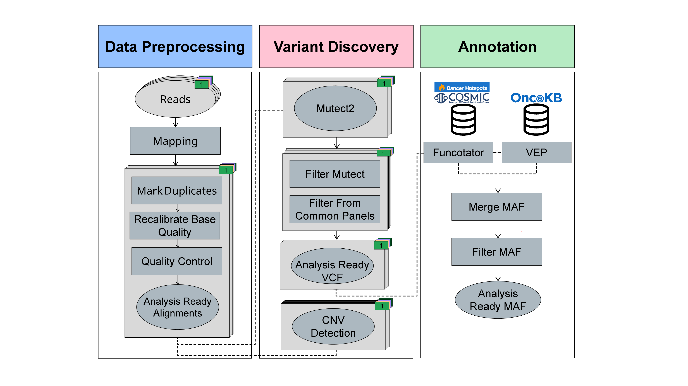
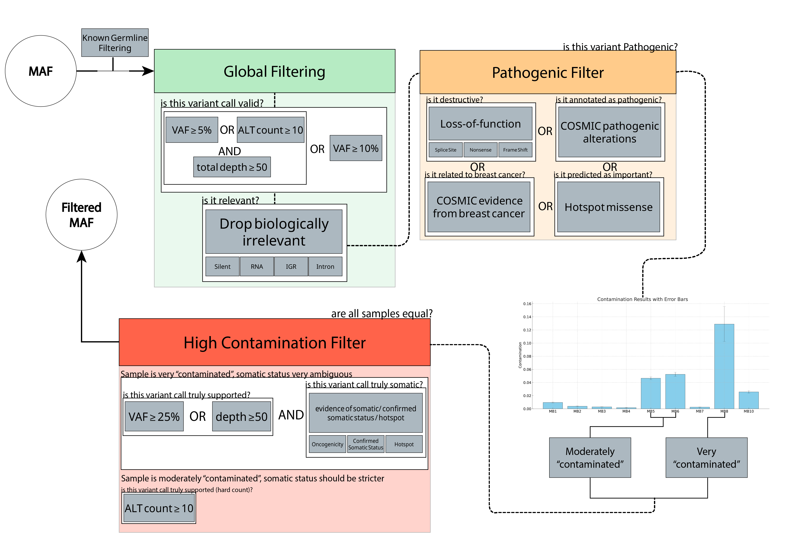
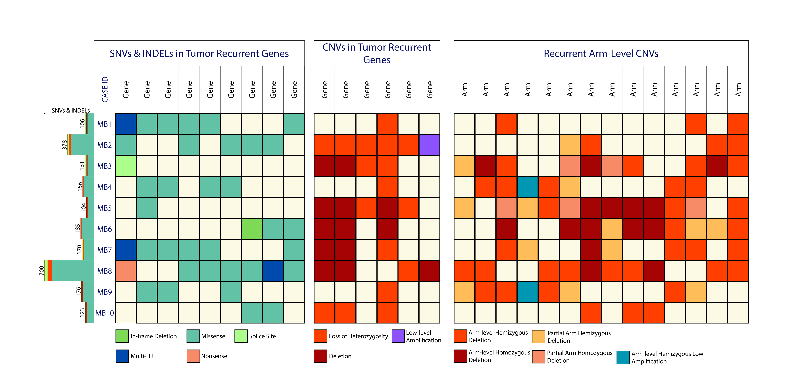
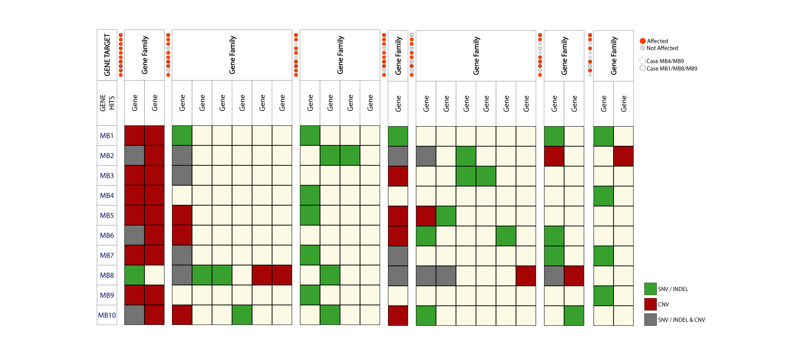

<p align="center">
  
</p>

<p align="center"><em>"Never tell me the odds!"</em></p>

# SoloVar — Somatic Variant Analysis Pipeline

<p align="center">
  
</p>

**SoloVar** is a modular, end-to-end toolkit for somatic variant and copy number analysis in tumor samples **without a matched normal**. Each stage is driven by a simple YAML config and can be run independently or chained in sequence.

---

## Table of Contents

- [Workflow Overview](#workflow-overview)
- [Dependencies](#dependencies)
- [Quick Start](#quick-start)
- [Stage-by-stage Guide](#stage-by-stage-guide)
  - [1. Trimming & QC](#1-trimming--qc)
  - [2. Mapping & BQSR](#2-mapping--bqsr)
  - [3. Somatic Variant Calling](#3-somatic-variant-calling)
  - [4. Germline Calling (optional)](#4-germline-calling-optional)
  - [5. Copy Number Analysis](#5-copy-number-analysis)
  - [6. VCF Annotation & MAF Conversion](#6-vcf-annotation--maf-conversion)
  - [7. MAF Post-processing](#7-maf-post-processing-filterpipe)
  - [8. CNV Summary](#8-cnv-summary-cnvpipe)
  - [9. SNV + CNV Integration](#9-snv--cnv-integration-combinepipe)
- [Script Reference](#script-reference)
- [Adapting to your project](#adapting-to-your-project)
- [CDH1 Smoke Test](#cdh1-smoke-test)
- [Example Results](#example-results)

---

## Workflow Overview

```
FASTQ
  │
  ▼
trimming_pipeline.sh          QC + trim (FastQC, fastp)
  │
  ▼
mapping_pipeline.sh           Align + BQSR (BWA-MEME, GATK)
  │            │
  │            └─► scripts/qc_mapping.py     Mapping QC plots
  │
  ▼
somatic_variant_calling_pipeline.sh   Mutect2 + FilterMutectCalls
  │
  ├──► germline_calling_pipeline.sh    (optional) Germline calling
  │
  ├──► cnvkit_pipeline.sh      CNV from BAMs
  │         
  ├──► purecn_pipeline.sh     Purity + per-variant CN
  │
  ▼
vcf_annotation_pipeline.sh    Funcotator → vcf2maf/VEP → OncoKB → merge MAFs
  │  (scripts/merge_mafs.py, scripts/filter_af.py)
  │
  ▼
pipes/filter.pipe             slim_maf → PureCN merge → filter_basic → filter_biological
  │
  ├──► pipes/cnv.pipe          Arm-level + gene-level CNV summaries
  │
  └──► pipes/combine.pipe      SNV + CNV integration
```

---

## Dependencies

| Tool | Used by |
|------|---------|
| `fastp`, `fastqc`, `multiqc` | trimming_pipeline.sh |
| `bwa-meme`, `samtools` | mapping_pipeline.sh |
| `picard` | mapping_pipeline.sh |
| `gatk` (≥4.4) | mapping, variant calling, Funcotator |
| `bcftools` | vcf_annotation_pipeline.sh |
| `vcf2maf` + VEP | vcf_annotation_pipeline.sh |
| `OncoKB MafAnnotator` | vcf_annotation_pipeline.sh |
| `cnvkit` | cnvkit_pipeline.sh |
| `PureCN` (R) | purecn_pipeline.sh |
| `GNU parallel` | mapping, variant, cnvkit pipelines |
| `python3` + `pandas`, `numpy`, `matplotlib`, `seaborn` | all Python scripts |
| `pysam` | scripts/filter_af.py only |

Install Python dependencies:
```bash
pip install pandas numpy matplotlib seaborn pysam tqdm
```

Install bioinformatics tools (conda recommended):
```bash
conda install -c bioconda bwa-meme samtools gatk4 bcftools fastqc multiqc fastp cnvkit parallel
```

> **OncoKB token**: register at [oncokb.org](https://www.oncokb.org) and set `export ONCOKB_TOKEN=your_token`.

---

## Quick Start

```bash
git clone https://github.com/yourname/SoloVar.git
cd SoloVar

# Copy an example config and fill in your paths
cp configs/mapping.yaml my_mapping.yaml
# edit my_mapping.yaml ...

bash mapping_pipeline.sh my_mapping.yaml
```

---

## Stage-by-stage Guide

### 1. Trimming & QC

**Script:** `trimming_pipeline.sh`  **Config:** `configs/trimming.yaml`

```yaml
samples: /path/to/sample_list.txt   # one FASTQ path per line (R1; R2 inferred as *_R2*)
output_directory: /path/to/output/
read_type: paired                    # paired or single
threads: 8
```

```bash
bash trimming_pipeline.sh configs/trimming.yaml
```

**Outputs:** FastQC HTML reports, MultiQC summary, trimmed FASTQs.

---

### 2. Mapping & BQSR

**Script:** `mapping_pipeline.sh`  **Config:** `configs/mapping.yaml`

```yaml
samples: /path/to/sample_list.txt
output_directory: /path/to/mapping_output/
threads: 16
reference: /path/to/Homo_sapiens_assembly38.fasta
paired: yes
markduplicates_enabled: yes
picard_path: /path/to/picard.jar
gatk_path: gatk
bqsr_enabled: yes
intervals: /path/to/capture_regions.bed
padding: 50
known_sites: "/path/to/dbsnp138.vcf.gz, /path/to/1000G_phase1.vcf.gz, /path/to/Mills_indels.vcf.gz"
```

```bash
bash mapping_pipeline.sh configs/mapping.yaml
```

**Outputs:** `f_*_recalibrated.bam` files, flagstat logs, QC plots (`scripts/qc_mapping.py` runs automatically).

---

### 3. Somatic Variant Calling

**Script:** `somatic_variant_calling_pipeline.sh`  **Config:** `configs/variant.yaml`

```yaml
bwa_files: /path/to/bam_dir/        # directory with f_*recalibrated*.bam
output_directory: /path/to/variants_output/
threads: 16
reference: /path/to/Homo_sapiens_assembly38.fasta
intervals: /path/to/capture_regions.bed
padding: 50
pon: /path/to/1000g_pon.hg38.vcf.gz
gr: /path/to/af-only-gnomad.hg38.vcf.gz
subgr: /path/to/small_exac_common_3.hg38.vcf.gz
gatk_path: gatk
learn_orientation: yes
parallel_mutect: yes
```

```bash
bash somatic_variant_calling_pipeline.sh configs/variant.yaml
```

**Outputs:** Per-sample filtered VCFs in `filtered_pass_vcf/`.

---

### 4. Germline Calling (optional)

**Script:** `germline_calling_pipeline.sh`

Runs GATK HaplotypeCaller in DRAGEN mode for germline variant calling. Uses the same BAMs produced by Stage 2.

```bash
bash germline_calling_pipeline.sh configs/dragencaller.yaml
```

---

### 5. Copy Number Analysis

**CNVkit — Script:** `cnvkit_pipeline.sh`  **Config:** `configs/cnvkit.yaml`

```yaml
bed: /path/to/capture_regions.bed
ref: /path/to/Homo_sapiens_assembly38.fasta
acc: /path/to/access-5kb-mappable.hg38.bed
out_dir: /path/to/cnvkit_output/
inputsamples: /path/to/bam_list.txt
cellularity_file: /path/to/cellularity.txt  # sample_id<TAB>purity%
annotation_file: /path/to/refFlat.txt
threads: 8
```

```bash
bash cnvkit_pipeline.sh configs/cnvkit.yaml
```

**PureCN — Script:** `purecn_pipeline.sh`

Estimates tumor purity and ploidy; annotates variants with per-variant somatic probability (`PureCN_ML_SOMATIC`, `PureCN_POSTERIOR_SOMATIC`).

```bash
bash purecn_pipeline.sh configs/purecn.yaml
```

**Outputs:** `*.call.cns` files (CNVkit), `*_variants.csv` (PureCN).

---

### 6. VCF Annotation & MAF Conversion

**Script:** `vcf_annotation_pipeline.sh`  **Config:** `configs/maf.yaml`

Three sub-steps run in sequence (each can be toggled):

| Flag | Step |
|------|------|
| always on | Funcotator → MAF (`maf_func/`) |
| `oncokb_enabled: yes` | bcftools rename → vcf2maf/VEP → OncoKB MafAnnotator (`maf_onko/`) |
| `merge_mafs_enabled: yes` | Merge Funcotator + OncoKB MAFs, add hotspot & COSMIC annotation |
| `AF_filtering_enabled: yes` | Filter against known germline VCF databases |

```bash
export ONCOKB_TOKEN=your_token
bash vcf_annotation_pipeline.sh configs/maf.yaml
```

**Outputs:** `combined_merged_with_cosmic.maf`, `af_filtered.maf`.

---

### 7. MAF Post-processing (`pipes/filter.pipe`)

Edit the CONFIG block at the top of `pipes/filter.pipe`, then run line-by-line or source:

```
pf_af_filtered.maf
  │
  slim_maf.py            coalesce _onko/_func columns, compute VAF, extract COSMIC IDs
  │
  merge_purecn.py        join PureCN per-variant data (ML_SOMATIC, POSTERIOR_SOMATIC, CN)
  │
  filter_basic.py        population AF gate (≤0.001), FILTER/ML conflict annotation
  │
  filter_biological.py   biological filter: LOF / OncoKB / hotspot / pathogenicity score
  │
  top_mutated_genes.py   top mutated genes per patient (drivers & passengers)
```

<p align="center">
  
</p>

```bash
# Edit MERGED_DIR and PURECN_ROOT at top of file, then:
bash pipes/filter.pipe
```

---

### 8. CNV Summary (`pipes/cnv.pipe`)

```bash
# Edit PROJECT_DIR, CNVKIT_CALLS, GENE_LIST at top of file, then:
bash pipes/cnv.pipe
```

Produces arm-level CNV calls and gene-level CNV summary.

---

### 9. SNV + CNV Integration (`pipes/combine.pipe`)

```bash
# Edit CONFIG block at top of file, then:
bash pipes/combine.pipe
```

Merges SNV MAF with CNV summary per gene/sample. Also produces mucinous/lobular comparison outputs.

---

## Script Reference

| Script | Stage | Description |
|--------|-------|-------------|
| `trimming_pipeline.sh` | 1 | FastQC + fastp trimming |
| `mapping_pipeline.sh` | 2 | BWA-MEME align, Picard dedup, GATK BQSR |
| `scripts/qc_mapping.py` | 2 | Mapping QC plots from flagstat logs |
| `somatic_variant_calling_pipeline.sh` | 3 | Mutect2 + FilterMutectCalls |
| `germline_calling_pipeline.sh` | 4 | DRAGEN-mode germline calling |
| `cnvkit_pipeline.sh` | 5 | CNVkit coverage, segmentation, calling |
| `purecn_pipeline.sh` | 5 | PureCN purity estimation + variant annotation |
| `vcf_annotation_pipeline.sh` | 6 | Funcotator, VEP/vcf2maf, OncoKB, MAF merge |
| `scripts/merge_mafs.py` | 6 | Merge Funcotator + OncoKB MAFs per sample |
| `scripts/filter_af.py` | 6 | Remove variants in known germline VCFs + dbSNP flags |
| `scripts/slim_maf.py` | 7 | Coalesce columns, compute VAF, extract COSMIC IDs |
| `scripts/merge_purecn.py` | 7 | Join PureCN per-variant data onto slim MAF |
| `scripts/filter_basic.py` | 7 | Population AF gate + FILTER/ML conflict flag |
| `scripts/filter_biological.py` | 7 | Biological filter (LOF, OncoKB, hotspot, pathogenicity) |
| `scripts/top_mutated_genes.py` | 7 | Top mutated genes per patient |
| `scripts/score_variants.py` | 7 | Driver scoring (OncoKB, hotspot, LOF, IMPACT, SIFT, PolyPhen) |
| `scripts/make_score_table.py` | 7 | IMPACT/SIFT/PolyPhen score table |
| `scripts/filter_by_gene_list.py` | 7 | Filter variants by custom gene list |
| `scripts/cnv_arm_summary.py` | 8 | Arm-level CNV aggregation from CNVkit |
| `scripts/cnv_cohort_report.py` | 8 | Cohort arm-level summary report |
| `scripts/cnv_gene_summary.py` | 8 | Gene-level CNV from gene list |
| `scripts/combine_snv_cnv.py` | 9 | Merge SNV MAF + CNV summary per gene/sample |
| `scripts/combine_comparison.py` | 9 | Mucinous/lobular comparison counts |

---

## Adapting to your project

> This pipeline was originally developed for the **ILCEM** breast cancer cohort analysis. The core pipeline — alignment, variant calling, annotation, CNV, and filtering — is fully general and should work out of the box for any tumor-only WES project. A handful of analysis scripts contain cohort-specific values (sample names, tissue type, tumor subtypes) that you will need to update before running on your own data. Everything else should be good to go.

Several scripts contain project-specific values that must be updated before use.

### Sample naming convention

`merge_purecn.py` and `merge_mafs.py` parse sample IDs from BAM filenames using the pattern `f_<SAMPLEID>_recalibrated`. If your BAMs follow a different naming scheme, update the regex at the top of each script:

```python
# merge_purecn.py — line ~12
m = re.search(r"f_(.+?)_recalibrated", x)   # ← adapt to your naming

# merge_mafs.py — line ~14
match = re.search(r"_([^_]+)_recalibrated", filename)   # ← adapt to your naming
```

### Sample → patient mapping

`top_mutated_genes.py` maps sample IDs to patient labels. Replace the hardcoded dict with your own cohort:

```python
# top_mutated_genes.py — lines 17-23
sample_to_patient = {
    "MB1": "Patient_1",   # ← replace with your sample IDs
    "MB2": "Patient_2",
    ...
}
```

Alternatively pass `--sample-column Tumor_Sample_Barcode` and skip the mapping entirely if your sample IDs are already patient labels.

### Per-sample quality thresholds

`filter_biological.py` applies extra depth/VAF gates to samples known to be noisy. Update `STRICT_SAMPLES` at the top of the file:

```python
# filter_biological.py — lines 10-13
STRICT_SAMPLES = {
    "MB5": (10, 40, 0.05),   # (min_alt_count, min_depth, min_vaf)
    "MB6": (10, 40, 0.05),   # ← replace with your noisy samples, or leave empty: {}
}
```

Set to `{}` to disable the per-sample gate entirely.

### Tissue / tumor type

`filter_biological.py` and `score_variants.py` apply a **breast cancer** bonus weight using COSMIC tissue counts. If your cohort is a different cancer type, replace `"breast"` with your primary tissue throughout those scripts, or remove the tissue-specific weight from the scoring function.

`combine_comparison.py` compares two tumor subtypes hardcoded as `"mucinous"` and `"lobular"`. Replace these with your own subtype labels:

```python
# combine_comparison.py — line 23
df = df[df["GeneGroup_norm"].isin({"mucinous", "lobular"})].copy()
# ↑ replace with your subtypes, e.g. {"luminalA", "TNBC"}
```

---

## CDH1 Smoke Test

A minimal test using 3 synthetic CDH1 variants to verify the post-processing pipeline works correctly. No BAMs or mapping required — runs in under 10 seconds.

```bash
cd test/
bash run_test.sh
```

**Expected output:**

```
Input variants:                3
After slim_maf:                3
After filter_basic:            2    ← row 3 removed (gnomADe_AF=0.002, byFrequency flag)
After filter_biological:       2    ← both oncogenic CDH1 missense variants retained
Breast-dominant:               2    ← both have strong breast COSMIC evidence
```

**Test data** (`test/data/`):

| File | Description |
|------|-------------|
| `cdh1_region.fa` | 10 kb CDH1 reference (chr16:68771576-68781575, hg38) |
| `cdh1_test.vcf` | 3 synthetic CDH1 somatic variants |
| `cdh1_test.maf` | Pre-annotated MAF with OncoKB/COSMIC/PureCN fields |
| `cdh1.bed` | CDH1 capture region BED |

---

## Example Results

<p align="center">
  
</p>

<p align="center">
  
</p>

---

## Issues & Contributions

Open an issue or pull request for questions, bugs, or improvements.
